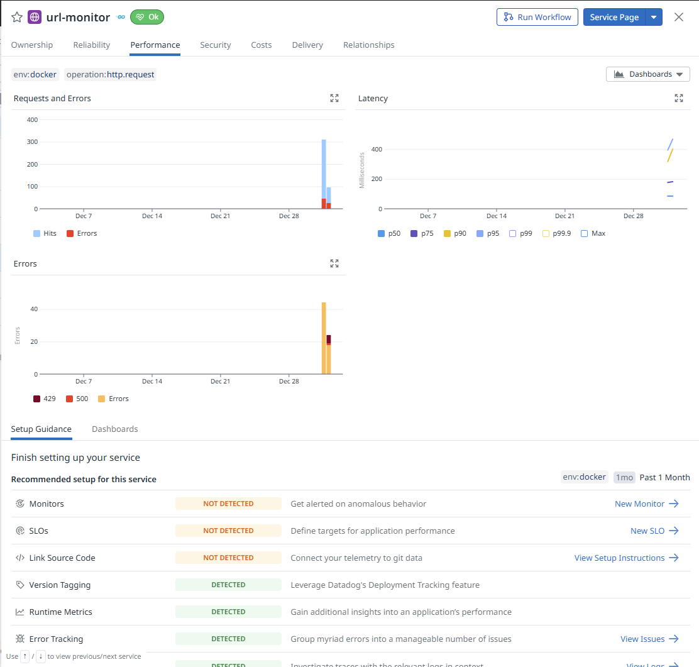
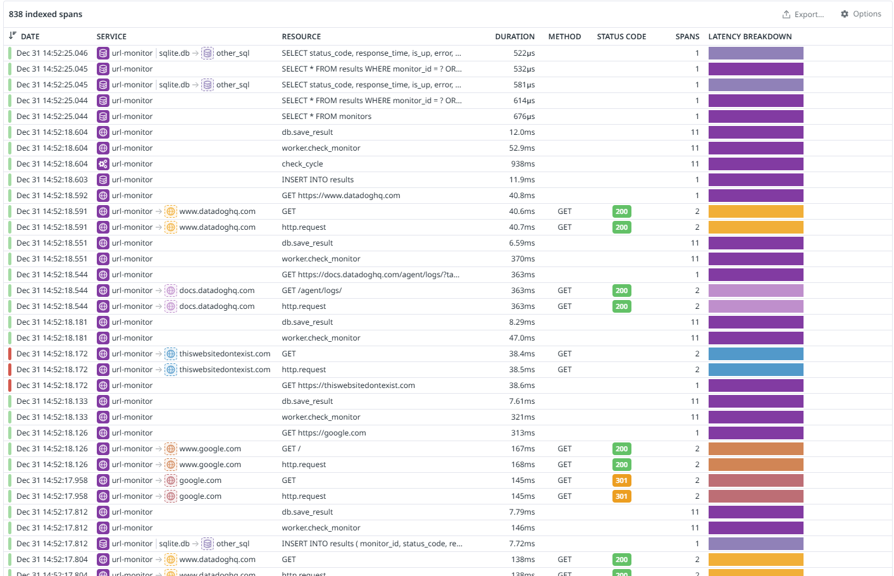
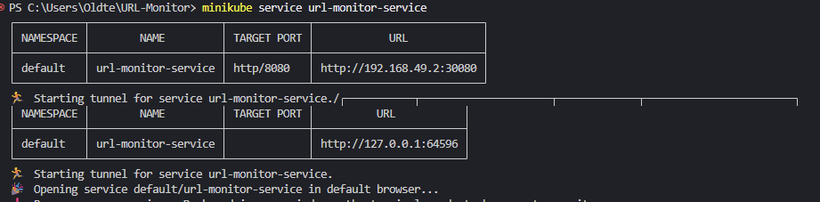
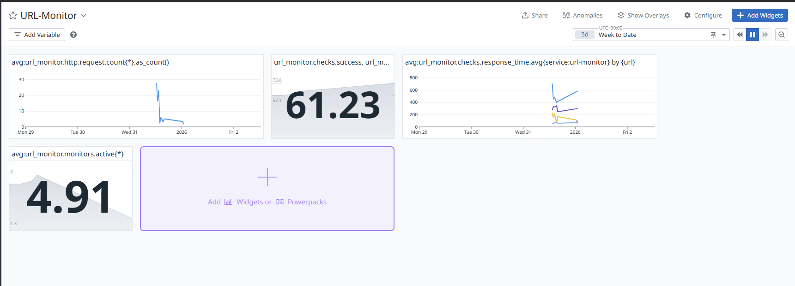

# URL-Monitor
A production-style URL monitoring service written in Go and fully instrumented with Datadog logs, metrics, and traces for my Datadog take-home project.

## Overview

For my take home project I built a simple URL monitoring web service built in Go with full Datadog observability. With this project I wanted to learn Go, Datadog Agent integration, and understand telemetry for the Agent Logs Pipeline team I'll be joining. 

In the end I was able to do all the steps to get a production ready app deployed to Kubernetes!

### Stack
**Languages**: Go  
**Storage**: SQLite  
**Observability**: Datadog Agent (logs, metrics, traces)  
**Infra**: Docker, Kubernetes (Minikube), Helm  

---

## Architecture
```bash
┌─────────────────────────────────────────────────────────┐
│                    HOST MACHINE (Windows)                │
│                                                          │
│  ┌─────────────┐         kubectl port-forward           │
│  │   Browser   │ ───────────────────────────────────►  │
│  │  (Frontend) │            localhost:8080              │
│  └─────────────┘                                        │
│                                                          │
│  ┌──────────────────────────────────────────────────┐  │
│  │         Minikube Cluster (Docker Container)       │  │
│  │                                                    │  │
│  │  ┌────────────────────────────────────────────┐  │  │
│  │  │  Namespace: default                         │  │  │
│  │  │                                             │  │  │
│  │  │  ┌──────────────────────────────────┐     │  │  │
│  │  │  │  Pod: url-monitor                │     │  │  │
│  │  │  │  ┌─────────────────────────┐    │     │  │  │
│  │  │  │  │  Container: url-monitor │    │     │  │  │
│  │  │  │  │  - Go app on :8080      │    │     │  │  │
│  │  │  │  │  - SQLite database      │    │     │  │  │
│  │  │  │  │  - Background worker    │    │     │  │  │
│  │  │  │  └────────┬────────────────┘    │     │  │  │
│  │  │  └───────────┼──────────────────────┘     │  │  │
│  │  │              │                             │  │  │
│  │  │  ┌───────────▼──────────────────────┐     │  │  │
│  │  │  │  Service: url-monitor-service    │     │  │  │
│  │  │  │  Type: NodePort                  │     │  │  │
│  │  │  │  Port: 8080:30080                │     │  │  │
│  │  │  └──────────────────────────────────┘     │  │  │
│  │  └────────────────────────────────────────────┘  │  │
│  │                                                    │  │
│  │  ┌────────────────────────────────────────────┐  │  │
│  │  │  Namespace: datadog                         │  │  │
│  │  │                                             │  │  │
│  │  │  ┌──────────────────────────────────┐     │  │  │
│  │  │  │  DaemonSet: datadog-agent        │     │  │  │
│  │  │  │  - Collects container logs       │     │  │  │
│  │  │  │  - Receives metrics (:8125 UDP)  │     │  │  │
│  │  │  │  - Receives traces (:8126 TCP)   │     │  │  │
│  │  │  └───────────┬──────────────────────┘     │  │  │
│  │  │              │                             │  │  │
│  │  │  ┌───────────▼──────────────────────┐     │  │  │
│  │  │  │  Cluster Agent                   │     │  │  │
│  │  │  │  - Cluster-level monitoring      │     │  │  │
│  │  │  └──────────────────────────────────┘     │  │  │
│  │  └────────────────────────────────────────────┘  │  │
│  └──────────────────────────────────────────────────┘  │
└─────────────────────────────────────────────────────────┘
                         │
                         │ HTTPS (API key)
                         ▼
              ┌─────────────────────┐
              │   Datadog Cloud     │
              │  datadoghq.com      │
              │                     │
              │  - APM Dashboard    │
              │  - Logs Explorer    │
              │  - Metrics Explorer │
              │  - Infrastructure   │
              └─────────────────────┘
```
### Build Phases
```
Phase 1: Core HTTP Service (Host)
  ↓
Phase 2: Unit Testing
  ↓
Phase 3: Metrics Instrumentation
  ↓
Phase 4: Structured Logging
  ↓
Phase 5: Datadog Agent Integration
  ↓
Phase 6: APM / Tracing
  ↓
Phase 7: Containerization (Docker)
  ↓
Phase 8: Kubernetes Deployment

```

## Implementation Deep Dive 

**Phase 1: Core Web Service**

- Implemented an HTTP API using Go’s `net/http` package.

- Designed a SQLite-backed datastore using `database/sql` with a small access layer. → `backend/db`

- Defined core domain models like `MonitorEntry` and `MonitorResult` and built handlers to create monitors, retrieve results, and persist check outcomes. → `backend/models`, `backend/handlers`

- Implemented a background worker running in a goroutine to periodically check registered URLs at a configurable interval. → `backend/worker`

- Added HTTP middleware for CORS handling, request/response logging, and enforcing consistent response headers. → `backend/middleware`

- Wired everything together using a multiplexer to apply middleware consistently across all routes. → `backend/routes`

This phase took the longest but formed the foundation for everything that followed. It forced me to think carefully about concurrency, persistence, and request flow early on!

**Phase 2: Unit Testing**

- Added unit tests using `httptest` and `testify`.

- Focused on both success paths and failure cases for handlers and worker logic.

- Reached ~80% coverage across core logic. → `backend/handlers/*_test.go`, `backend/worker/*_test.go`

This phase reinforced the importance of writing tests alongside implementation rather than batching them at the end. A lesson I definitely felt here.

**Phase 3: Metrics Instrumentation**

- Created a global DogStatsD client for emitting counters, gauges, and histograms. → `backend/metrics`

- Integrated metrics into HTTP middleware and background workers. → `backend/middleware/metrics.go`

I specifically wanted request latency histograms, active monitor gauges, and error counters. Seeing these metrics flow into the Datadog UI and building a dashboard around them was one of my favorite parts of the project.

**Phase 4: Structured Logging**

- Implemented a global structured logger that writes logs to both stdout and disk.

- Logs are written in JSON format to → `logs/url-monitor.log`

This setup was designed specifically to work well with the Datadog Agent’s log collection pipeline. (Super Excited!)

**Phase 5: Datadog Agent Integration**

- Installed and configured the Datadog Agent locally.

- Configured log collection to ingest `url-monitor.log`.

- Verified logs appeared correctly in the Datadog Logs Explorer with proper service and source attributions.

This was a big moment for me seeing the Agent running locally, tailing logs, and shipping them into Datadog made the observability really click for me.

**Phase 6: Tracing (APM)**

- Added tracing using `dd-trace-go`.

- Created parent/child spans around:

    - HTTP request handling

    - Database reads/writes

    - External URL checks

- Enabled HTTP server and client instrumentation (WrapHandler, WrapClient).

Being able to follow a single request end-to-end through handlers, workers, and database operations in real time was super satisfying.

**Phase 7: Containerization (Docker)**

- Containerized the application using Docker.

- Used Docker Compose to run the application alongside the Datadog Agent. → `backend/Dockerfile`, `docker-compose.yml`

Learned how to keep SQLite data across container restarts and how multiple containers communicate over a shared network. I had prior Docker experience, but integrating a datastore and observability stack added a new layer of complexity that was fun to work through.

**Phase 8: Kubernetes Deployment**

- Deployed the application to a local Minikube cluster.

- Used Helm to deploy the Datadog Agent.

- Exposed the service via NodePort and accessed it using kubectl port-forward.

Kubernetes introduced a lot of new concepts around networking and deployment, and while there’s still more to learn, it was exciting to see everything running and observable inside a cluster.

## Datadog UI & Screenshots

### APM Service Map:


### List of Traces:


### Kubernetes View:


### Custom Dashboard:



Thank you for the opportunity to work on this project. It was a great introduction to the Datadog Agent ecosystem and gave me a much deeper appreciation for how logs, metrics, and traces come together in a real system.